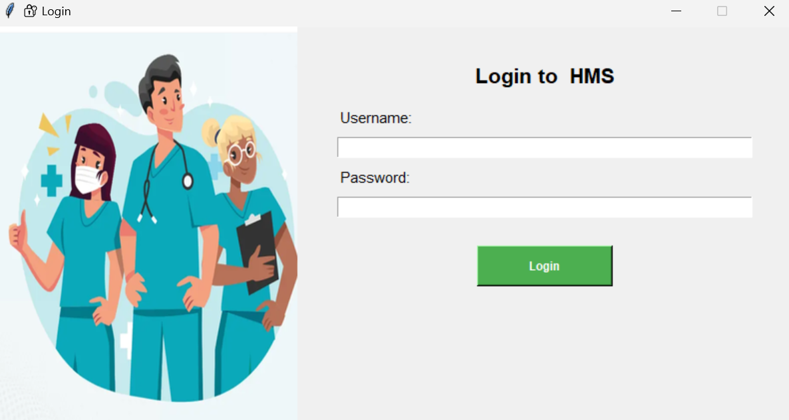
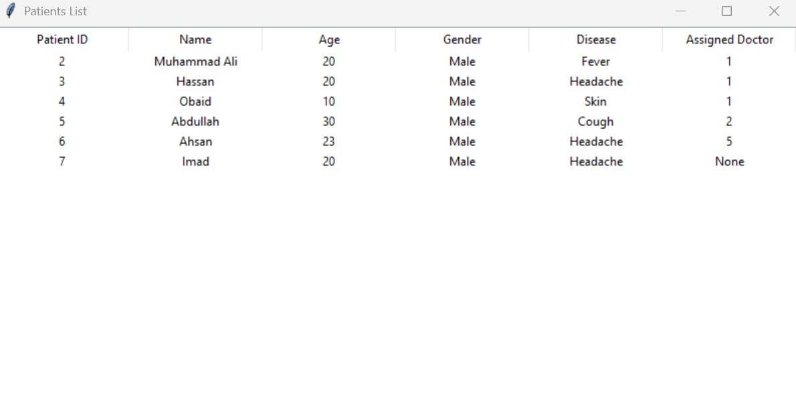
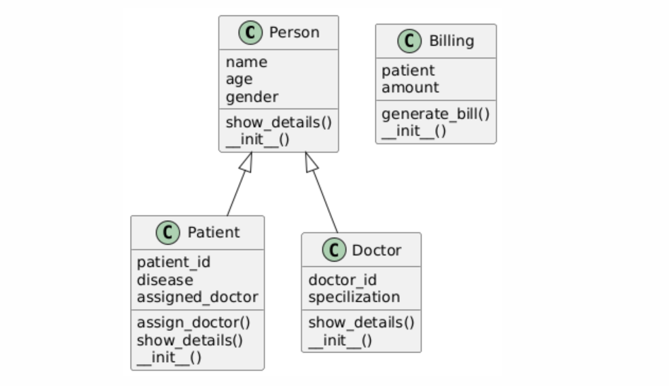

# 🏥 Hospital Management System – OOP Project (Python + MySQL)


A Python-based Hospital Management System that combines ***Object-Oriented Programming***, a Tkinter GUI, CLI options, and **MySQL** integration. It enables users to manage patient data, doctor assignments, billing, and user authentication through a clean, modular architecture.

---

##  Features

- 🔐 Login Authentication System  
- ➕ Add / 🗑️ Delete Patients  
- 👨‍⚕️ Add Doctors & Assign Them to Patients  
- 📄 View Patient and Doctor Details  
- 💳 Generate Billing Information  
- 🖥️ GUI-based and CLI-based operation  
- 🛢️ MySQL Database Integration  

---

##  Tech Stack

- **Language:** Python  
- **GUI:** Tkinter & CustomTkinter  
- **Interface:** CLI and GUI  
- **Database:** MySQL (`hospital_db`)  
- **Design Pattern:** Object-Oriented Programming  

---

## 📁 Project Structure
```
Hospital-Management/
├── main.py      # CLI version
├── main_gui.py  # GUI interface
├── login.py     # Login window with GUI
├── database.py  # MySQL DB connection
├── model/ # OOP-based entity classes
│ ├── person.py
│ ├── patient.py
│ ├── doctor.py
│ └── billing.py
└── .venv/    # Optional virtual environment
```
---

## 🛠 Setup Instructions

### 1.  Clone the Repository :

```bash
git clone https://github.com/yourusername/hospital-management-system.git
cd Hospital-Management
```

### 2.  (Optional) Create a Virtual Environment :

```
python -m venv .venv
source .venv/bin/activate  # For Windows: .venv\Scripts\activate
```
### 3.  Install Dependencies :

```
pip install customtkinter mysql-connector-python
```
### 4. Set Up MySQL Database :

- Make sure your MySQL server is running.
- Open Database.txt and execute its SQL statements in your MySQL client (e.g., phpMyAdmin, MySQL Workbench, or terminal).
- This will create the hospital_db database and necessary tables.

### 5.  Run the Application :
Run the GUI version:
```
python login.py
```
Run the CLI version:
```
python main.py
```

###  Sample Credentials :

- Username: admin@hms.com
- Password: 1234
(You can customize this in login.py)

###  Screenshots

###  Login Window :


### Main Screen :


### Show Details :



## 🧩 Class Diagram :
The following diagram shows the relationships between core classes in the Hospital Management System for CLI version :



### 🧠 Concepts Demonstrated :

- Object-Oriented Programming (Inheritance, Encapsulation, Composition)
- GUI development with Tkinter and CustomTkinter
- Integration of MySQL with Python using mysql-connector-python
- Functional separation between logic, database, and interface
- CLI and GUI support for managing hospital operations

### Authors :

Group Project

- [Muhammad Ali Siddiqui](www.github.com/alibro005)
- [Muhammad Sami](www.github.com/samibro002)

### 📚 References :

- Tkinter — used for building the graphical user interface in Python.
- MySQL — used as the backend database system.
- Python MySQL Connector — for integrating Python with MySQL.
- Object-Oriented Programming (OOP) concepts — used to structure classes like Patient, Doctor, and Billing.
- Project developed as part of Object-Oriented Programming coursework at NCBA&E.

###  License :

This project is licensed under the MIT License — see the [LICENSE](LICENSE) file for details.


