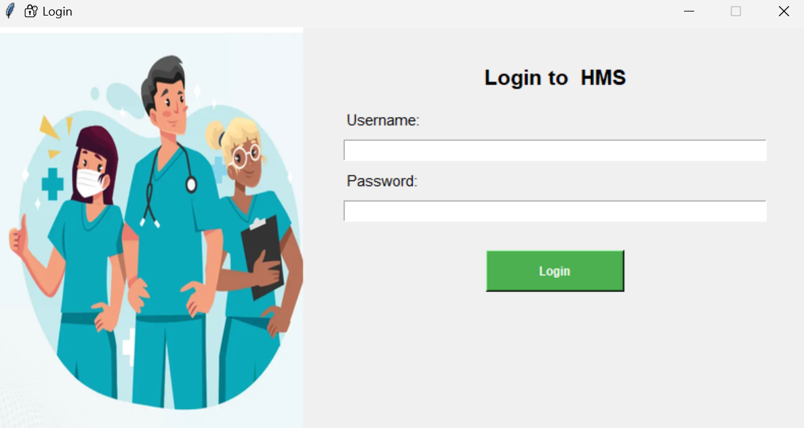
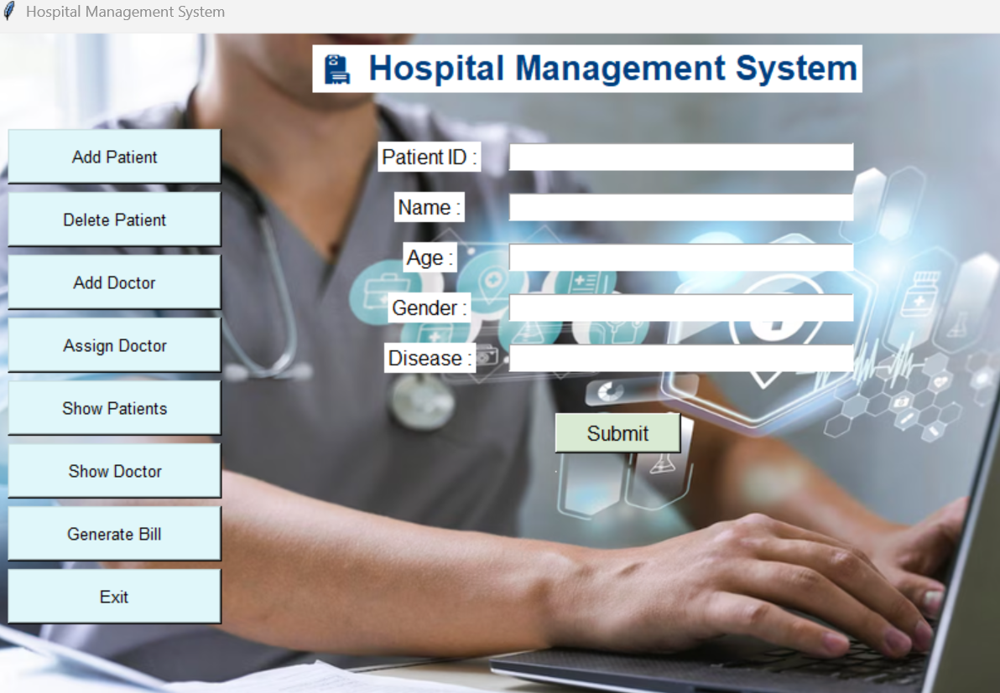
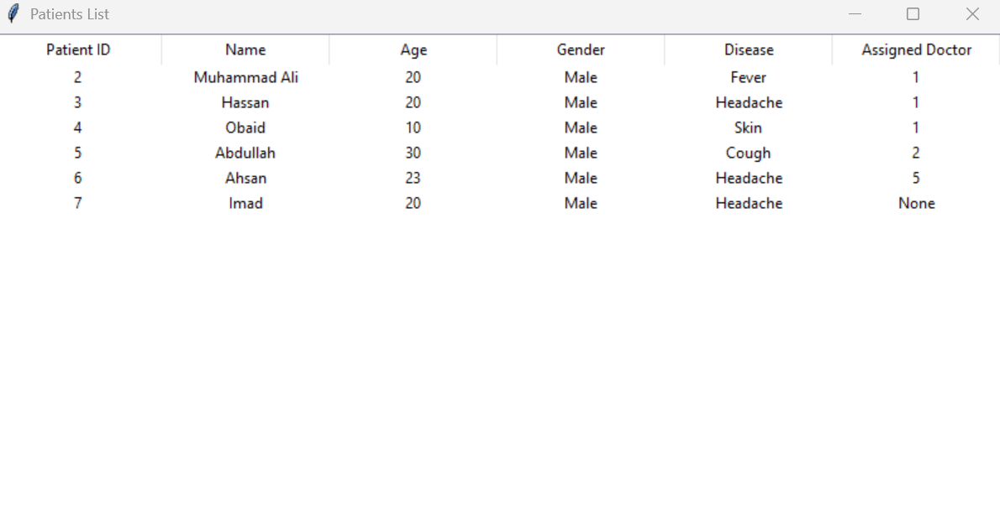
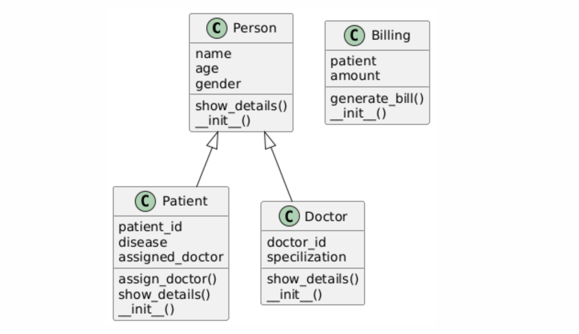

# Hospital Management System – OOP Project (Python + MySQL)


A Python-based Hospital Management System that combines ***Object-Oriented Programming***, a Tkinter GUI, CLI options, and **MySQL** integration. It enables users to manage patient data, doctor assignments, billing, and user authentication through a clean, modular architecture.

---

## Table of Contents

- [Overview](#overview)
- [Features](#features)
- [Tech Stack](#tech-stack)
- [Project Structure](#project-structure)
- [Setup Instructions](#setup-instructions)
  - [1. Clone the Repository](#1-clone-the-repository)
  - [2. Create a Virtual Environment](#2-create-a-virtual-environment)
  - [3. Install Dependencies](#3-install-dependencies)
  - [4. Set Up MySQL Database](#4-set-up-mysql-database)
  - [5. Run the Application](#5-run-the-application)
- [Sample Credentials](#sample-credentials)
- [Screenshots](#screenshots)
  - [Login Window](#login-window)
  - [Main Screen](#main-screen)
  - [Show Details](#show-details)
- [Class Diagram](#class-diagram)
- [Concepts Demonstrated](#concepts-demonstrated)
- [Authors](#authors)
- [References](#references)
- [License](#license)

  

## Overview

This project is a desktop-based Hospital Management System built with Python.

It was developed to apply Object-Oriented Programming concepts to a practical application while also working with a relational database and graphical user interface.

The application provides both GUI and CLI versions and uses MySQL to store and manage hospital-related data.

The main operations include:

- User authentication
- Adding and deleting patients
- Adding doctors
- Assigning doctors to patients
- Viewing patient and doctor information
- Generating billing information
- Managing data through MySQL


##  Features

- Login Authentication System  
-  Add / Delete Patients  
-  Add Doctors & Assign Them to Patients  
-  View Patient and Doctor Details  
- Generate Billing Information  
-  GUI-based and CLI-based operation  
-  MySQL Database Integration  

---

##  Tech Stack

- **Language:** Python  
- **GUI:** Tkinter & CustomTkinter  
- **Interface:** CLI and GUI  
- **Database:** MySQL (`hospital_db`)  
- **Design Pattern:** Object-Oriented Programming  

---

## Project Structure
```
Hospital-Management/
├── main.py         # CLI version
├── main_gui.py     # GUI interface
├── login.py        # Login window with GUI
├── database.py     # MySQL DB connection
├── model/          # OOP-based entity classes
│ ├── person.py
│ ├── patient.py
│ ├── doctor.py
│ └── billing.py
└── .venv/          # Optional virtual environment
```
---


## Setup Instructions

### 1. Clone the Repository

```bash
git clone https://github.com/alibro005/Hospital-Management-System.git
cd Hospital-Management-System
```

### 2. Create a Virtual Environment

For Windows:

```bash
python -m venv .venv
.venv\Scripts\activate
```

For macOS/Linux:

```bash
python -m venv .venv
source .venv/bin/activate
```

### 3. Install Dependencies

```bash
pip install customtkinter mysql-connector-python
```

### 4. Set Up MySQL Database

Make sure your MySQL server is running.

Open `Database.txt` and execute the SQL statements using a MySQL client such as MySQL Workbench, phpMyAdmin, or the MySQL command line.

This will create the `hospital_db` database and the required tables.

Before running the application, update the MySQL connection details in `database.py` according to your local MySQL configuration.

### 5. Run the Application

To run the GUI version:

```bash
python login.py
```

To run the CLI version:

```bash
python main.py
```

---

## Sample Credentials

- Username: admin@hms.com
- Password: 1234
(You can customize this in login.py)

## Screenshots

### Login Window


### Main Screen


### Show Details



## Class Diagram 
The following diagram shows the relationships between core classes in the Hospital Management System for CLI version :



### Concepts Demonstrated 

- Object-Oriented Programming (Inheritance, Encapsulation, Composition)
- GUI development with Tkinter and CustomTkinter
- Integration of MySQL with Python using mysql-connector-python
- Functional separation between logic, database, and interface
- CLI and GUI support for managing hospital operations


### Authors

- [Muhammad Ali Siddiqui](www.github.com/alibro005)

### References

- Tkinter used for building the graphical user interface in Python.
- MySQL used as the backend database system.
- Python MySQL Connector for integrating Python with MySQL.
- Object-Oriented Programming (OOP) concepts used to structure classes like Patient, Doctor, and Billing.
- Project developed as part of Object-Oriented Programming coursework at NCBA&E.

###  License 

This project is licensed under the MIT License see the [LICENSE](LICENSE) file for details.


